# 📊 Compose Charts Library

A comprehensive, feature-rich charting library for Jetpack Compose, inspired by Recharts. Create beautiful, interactive charts with minimal code.

[](https://developer.android.com/jetpack/compose)
[](https://kotlinlang.org/)
[](https://android-arsenal.com/api?level=21)
[](https://opensource.org/licenses/Apache-2.0)

## ✨ Features

- 🎨 **9 Chart Types**: Area, Bar, Line, Pie, Scatter, Radar, Composed, TreeMap, and Radial Bar charts
- 📱 **Fully Responsive**: Charts adapt to different screen sizes and orientations
- 🎭 **Highly Customizable**: Extensive styling and configuration options
- ⚡ **Performance Optimized**: Smooth animations and efficient rendering
- 🖱️ **Interactive**: Built-in support for click events and tooltips
- 🎯 **Type-Safe**: Leverages Kotlin's type system for safer code
- 🧩 **Composable**: Built with Jetpack Compose from the ground up
- 📊 **Multiple Data Sets**: Support for multiple series in a single chart
- 🎨 **Gradient Support**: Beautiful gradient fills for area and bar charts
- 🔄 **Animations**: Smooth entry and update animations

## 📸 Chart Gallery

### Area Charts
<p align="center">
  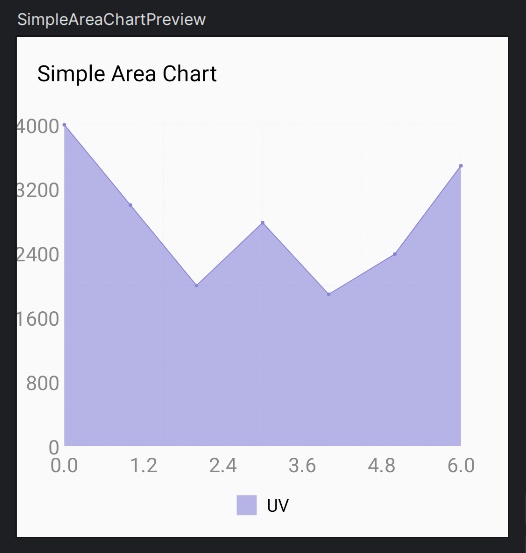
  
  
</p>

<p align="center">
  
  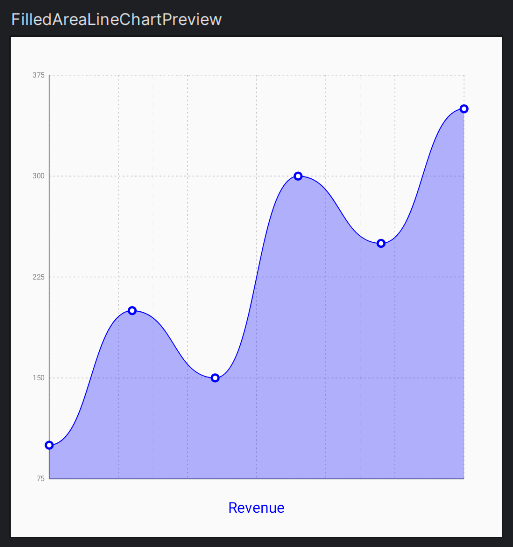
  
</p>

<p align="center">
  
  
  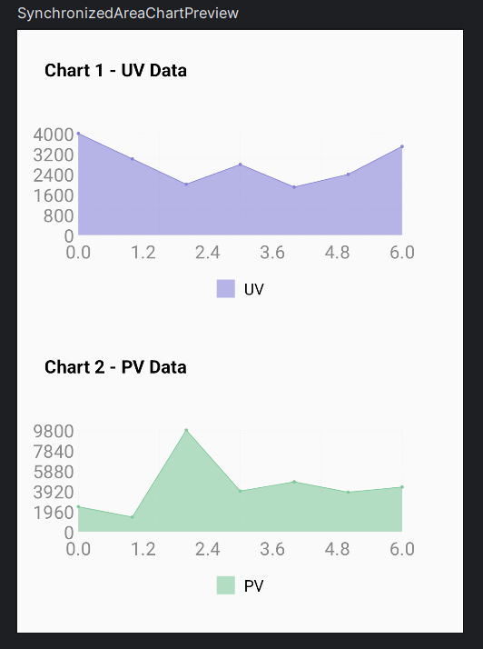
</p>

### Bar Charts
<p align="center">
  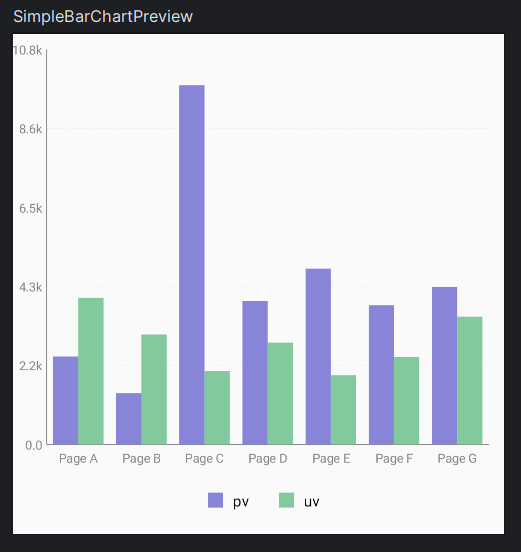
  
  
</p>

<p align="center">
  
  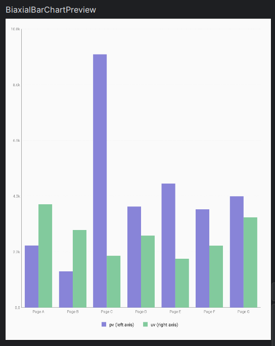
  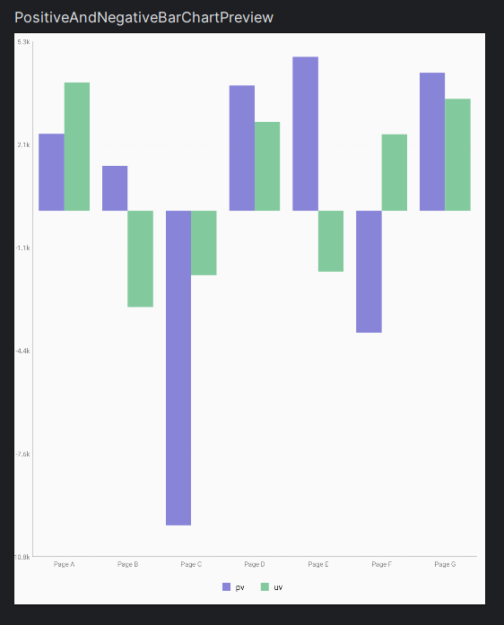
</p>

### Line Charts
<p align="center">
  
  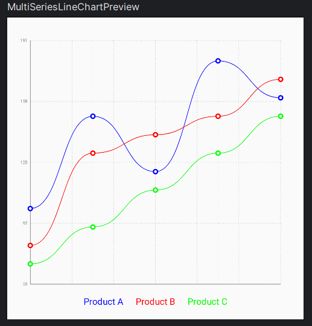
  
</p>

<p align="center">
  
  
  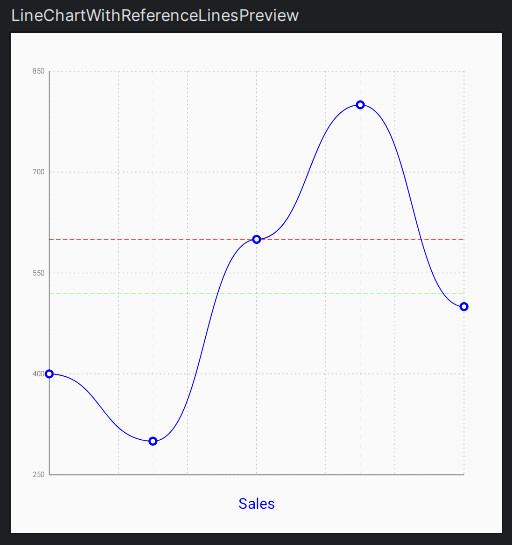
</p>

<p align="center">
  
  
  
</p>

### Pie Charts
<p align="center">
  
  
</p>

### Radar Charts
<p align="center">
  
  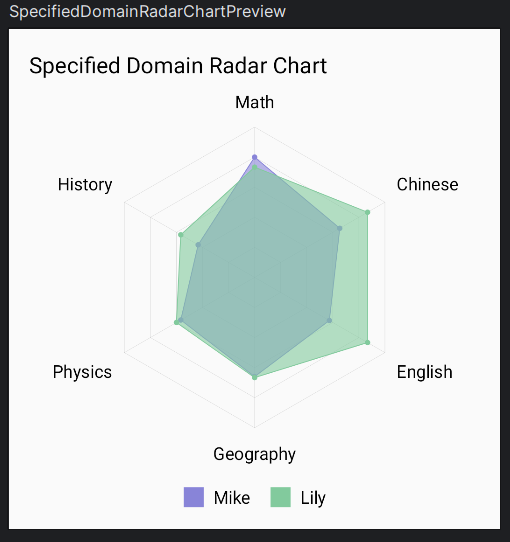
</p>

### Composed Charts
<p align="center">
  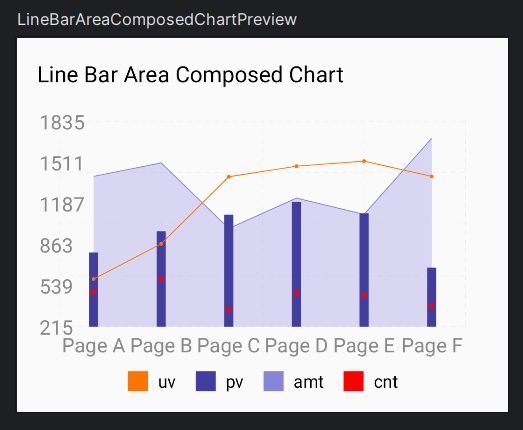
  
  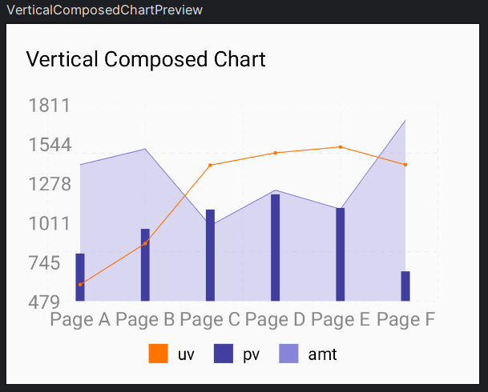
</p>

<p align="center">
  
  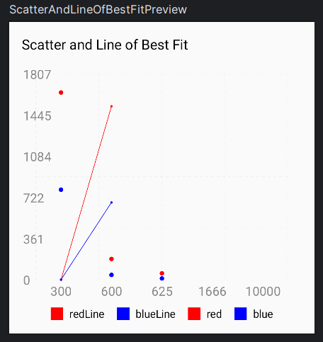
  
</p>

### Radial Bar Charts
<p align="center">
  
</p>

### Responsive Charts
<p align="center">
  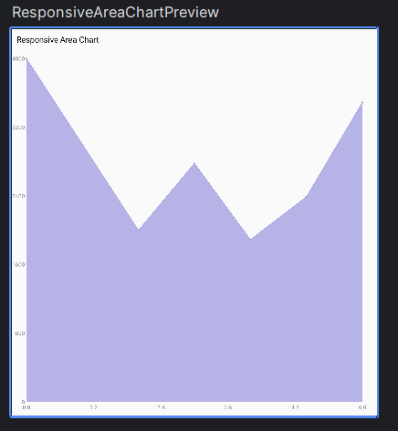
  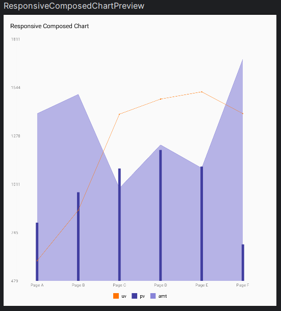
  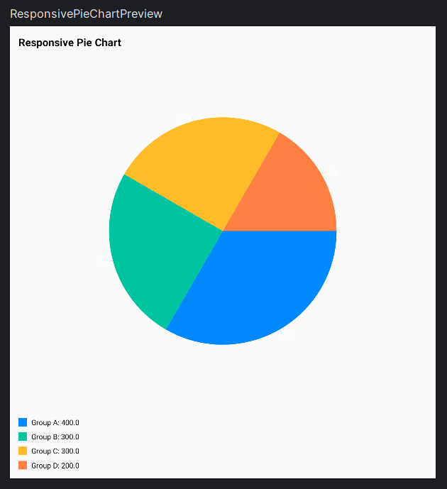
</p>

## 🚀 Installation

### Gradle (Kotlin DSL)

Add the dependency to your app's `build.gradle.kts`:

```kotlin
dependencies {
    implementation("com.majid2851:compose-charts:1.0.0")
}
```

### Gradle (Groovy)

Add the dependency to your app's `build.gradle`:

```groovy
dependencies {
    implementation 'com.majid2851:compose-charts:1.0.0'
}
```

### Maven

```xml
<dependency>
    <groupId>com.majid2851</groupId>
    <artifactId>compose-charts</artifactId>
    <version>1.0.0</version>
</dependency>
```

## 📖 Quick Start

### Simple Line Chart

```kotlin
@Composable
fun MyLineChart() {
    SimpleLineChart(
        title = "Monthly Sales",
        categories = listOf("Jan", "Feb", "Mar", "Apr", "May", "Jun"),
        values = listOf(400f, 300f, 600f, 800f, 500f, 700f),
        lineColor = Color.Blue,
        modifier = Modifier
            .fillMaxWidth()
            .height(300.dp)
    )
}
```

### Simple Bar Chart

```kotlin
@Composable
fun MyBarChart() {
    SimpleBarChart(
        title = "Product Sales",
        categories = listOf("Product A", "Product B", "Product C", "Product D"),
        values = listOf(2400f, 1398f, 9800f, 3908f),
        barColor = Color(0xFF8884d8),
        modifier = Modifier
            .fillMaxWidth()
            .height(300.dp)
    )
}
```

### Simple Pie Chart

```kotlin
@Composable
fun MyPieChart() {
    SimplePieChart(
        title = "Market Share",
        slices = listOf(
            PieSlice("Chrome", 45f, Color(0xFF0088FE)),
            PieSlice("Safari", 25f, Color(0xFF00C49F)),
            PieSlice("Firefox", 20f, Color(0xFFFFBB28)),
            PieSlice("Edge", 10f, Color(0xFFFF8042))
        ),
        showLegend = true,
        modifier = Modifier
            .fillMaxWidth()
            .height(350.dp)
    )
}
```

### Bubble Chart

```kotlin
@Composable
fun MyBubbleChart() {
    BubbleChart(
        title = "3D Data Visualization",
        scatterSets = listOf(
            ScatterDataSet(
                label = "Group A",
                dataPoints = listOf(
                    ScatterPoint(100f, 200f, mapOf("z" to 20f)),
                    ScatterPoint(120f, 100f, mapOf("z" to 30f)),
                    ScatterPoint(170f, 300f, mapOf("z" to 15f))
                ),
                pointColor = Color.Red
            )
        ),
        zAxisConfig = ZAxisConfig(dataKey = "z", range = Pair(10f, 50f)),
        modifier = Modifier
            .fillMaxWidth()
            .height(400.dp)
    )
}
```

### Radar Chart

```kotlin
@Composable
fun MyRadarChart() {
    SimpleRadarChart(
        title = "Student Performance",
        labels = listOf("Math", "Physics", "Chemistry", "Biology", "English", "History"),
        values = listOf(85f, 90f, 78f, 88f, 92f, 80f),
        dataSetLabel = "Student A",
        lineColor = Color(0xFF8884d8),
        fillColor = Color(0xFF8884d8),
        modifier = Modifier
            .fillMaxWidth()
            .height(400.dp)
    )
}
```

### Composed Chart (Multiple Chart Types)

```kotlin
@Composable
fun MyComposedChart() {
    LineBarAreaComposedChart(
        title = "Sales Analytics",
        categories = listOf("Jan", "Feb", "Mar", "Apr", "May", "Jun"),
        areaDataSets = listOf(
            AreaDataSet(
                label = "Revenue",
                dataPoints = listOf(/*...*/),
                fillColor = Color(0xFF8884d8)
            )
        ),
        barDataSets = listOf(
            ComposedBarDataSet(
                label = "Orders",
                dataPoints = listOf(/*...*/),
                color = Color(0xFF82ca9d)
            )
        ),
        lineDataSets = listOf(
            LineDataSet(
                label = "Profit",
                dataPoints = listOf(/*...*/),
                lineColor = Color(0xFFffc658)
            )
        ),
        modifier = Modifier
            .fillMaxWidth()
            .height(400.dp)
    )
}
```

### Radial Bar Chart

```kotlin
@Composable
fun MyRadialBarChart() {
    SimpleRadialBarChart(
        title = "Age Distribution",
        bars = listOf(
            RadialBarEntry("18-24", 31.47f, Color(0xFF8884d8)),
            RadialBarEntry("25-29", 26.69f, Color(0xFF83a6ed)),
            RadialBarEntry("30-34", 15.69f, Color(0xFF8dd1e1)),
            RadialBarEntry("35-39", 8.22f, Color(0xFF82ca9d))
        ),
        showLegend = true,
        modifier = Modifier
            .fillMaxWidth()
            .height(400.dp)
    )
}
```

### TreeMap Chart

```kotlin
@Composable
fun MyTreeMap() {
    SimpleTreeMap(
        title = "File System Size",
        nodes = listOf(
            TreeMapNode(
                name = "Documents",
                children = listOf(
                    TreeMapNode("PDFs", size = 5000f),
                    TreeMapNode("Images", size = 8000f),
                    TreeMapNode("Videos", size = 15000f)
                )
            ),
            TreeMapNode(
                name = "Applications",
                children = listOf(
                    TreeMapNode("System", size = 12000f),
                    TreeMapNode("User", size = 7000f)
                )
            )
        ),
        modifier = Modifier
            .fillMaxWidth()
            .height(400.dp)
    )
}
```

## 🎨 Customization

All charts support extensive customization options:

### Common Properties

| Property | Type | Description | Default |
|----------|------|-------------|---------|
| `title` | `String?` | Chart title | `null` |
| `modifier` | `Modifier` | Compose modifier | `Modifier` |
| `width` | `Dp` | Chart width | `400.dp` |
| `height` | `Dp` | Chart height | `300.dp` |
| `showGrid` | `Boolean` | Show grid lines | `true` |
| `showAxis` | `Boolean` | Show axis | `true` |
| `showLegend` | `Boolean` | Show legend | `true` |
| `chartPadding` | `Dp` | Internal padding | `16.dp` |
| `isInteractive` | `Boolean` | Enable interactions | `true` |

### Chart-Specific Styling

#### Line Chart
- `lineColor`: Color of the line
- `lineWidth`: Width of the line
- `isCurved`: Smooth curved lines
- `showPoints`: Show data points
- `pointSize`: Size of data points
- `gradientColors`: Gradient below line

#### Bar Chart
- `barColor`: Color of bars
- `barSize`: Width of bars
- `orientation`: Horizontal or Vertical
- `isStacked`: Stack multiple series
- `barRadius`: Rounded corners

#### Pie Chart
- `innerRadius`: Donut hole size (0-1)
- `outerRadius`: Outer radius (0-1)
- `labelPosition`: Inside or outside labels
- `startAngle`: Starting angle
- `sliceSpacing`: Gap between slices

#### Scatter/Bubble Chart
- `pointColor`: Color of points
- `pointSize`: Size of points
- `showLine`: Connect points with line
- `zAxisConfig`: Configure Z-axis for bubble size

#### Radar Chart
- `outerRadius`: Chart size (0-1)
- `domain`: Value range
- `showGrid`: Show concentric circles
- `polarGridConfig`: Customize grid appearance

## 📱 Responsive Charts

Use responsive containers for charts that adapt to available space:

```kotlin
@Composable
fun MyResponsiveChart() {
    ResponsiveContainer(
        modifier = Modifier
            .fillMaxWidth()
            .height(300.dp)
    ) { width, height ->
        LineChart(
            data = myData,
            modifier = Modifier.fillMaxSize()
        )
    }
}
```

Pre-built responsive variants:
- `ResponsiveAreaChart()`
- `ResponsiveComposedChart()`
- `ResponsivePieChart()`

## 🎯 Advanced Features

### Multiple Data Sets

```kotlin
MultiLineChart(
    title = "Temperature Comparison",
    lines = listOf(
        LineDataSet(
            label = "City A",
            dataPoints = cityAData,
            lineColor = Color.Red
        ),
        LineDataSet(
            label = "City B",
            dataPoints = cityBData,
            lineColor = Color.Blue
        )
    ),
    modifier = Modifier.fillMaxWidth()
)
```

### Custom Callbacks

```kotlin
SimpleBarChart(
    title = "Sales",
    categories = categories,
    values = values,
    onBarClick = { category, value, index ->
        println("Clicked: $category with value $value")
    },
    modifier = Modifier.fillMaxWidth()
)
```

### Gradient Fills

```kotlin
SimpleAreaChart(
    title = "Revenue",
    categories = months,
    values = revenue,
    gradientColors = listOf(
        Color(0xFF8884d8),
        Color(0xFF8884d8).copy(alpha = 0.3f)
    ),
    modifier = Modifier.fillMaxWidth()
)
```

### Custom Axis Labels

```kotlin
ComposedChartWithAxisLabels(
    title = "Performance Metrics",
    xAxisLabel = "Time Period",
    yAxisLabel = "Value (Units)",
    xLabelPosition = LabelPosition.INSIDE_BOTTOM,
    yLabelPosition = LabelPosition.INSIDE_LEFT,
    modifier = Modifier.fillMaxWidth()
)
```

## 📚 Complete Documentation

For detailed documentation on each chart type, see:

- [Area Charts Guide](docs/AREA_CHARTS.md)
- [Bar Charts Guide](docs/BAR_CHARTS.md)
- [Line Charts Guide](docs/LINE_CHARTS.md)
- [Pie Charts Guide](docs/PIE_CHARTS.md)
- [Scatter Charts Guide](docs/SCATTER_CHARTS.md)
- [Radar Charts Guide](docs/RADAR_CHARTS.md)
- [Composed Charts Guide](docs/COMPOSED_CHARTS.md)
- [TreeMap Charts Guide](docs/TREEMAP_CHARTS.md)
- [Radial Bar Charts Guide](docs/RADIAL_BAR_CHARTS.md)

## 🏗️ Architecture

The library follows clean architecture principles:

```
compose-charts/
├── domain/           # Data models and business logic
│   └── model/       # Chart data classes
├── ui/
│   ├── components/  # Chart implementations
│   │   ├── area/
│   │   ├── bar/
│   │   ├── line/
│   │   ├── pie/
│   │   ├── scatter/
│   │   ├── radar/
│   │   ├── composed/
│   │   ├── treemap/
│   │   └── radialbar/
│   └── theme/       # Theming and styling
└── utils/           # Helper utilities
```

## 🤝 Contributing

Contributions are welcome! Please read our [Contributing Guide](CONTRIBUTING.md) for details on our code of conduct and the process for submitting pull requests.

### Development Setup

1. Clone the repository:
```bash
git clone https://github.com/majid2851/compose-charts.git
cd compose-charts
```

2. Open in Android Studio
3. Build the project
4. Run the sample app to see all chart examples

## 📝 License

```
Copyright 2024 Majid Bagheri

Licensed under the Apache License, Version 2.0 (the "License");
you may not use this file except in compliance with the License.
You may obtain a copy of the License at

    http://www.apache.org/licenses/LICENSE-2.0

Unless required by applicable law or agreed to in writing, software
distributed under the License is distributed on an "AS IS" BASIS,
WITHOUT WARRANTIES OR CONDITIONS OF ANY KIND, either express or implied.
See the License for the specific language governing permissions and
limitations under the License.
```

## 🙏 Acknowledgments

- Inspired by [Recharts](https://recharts.org/) - A composable charting library built on React components
- Built with [Jetpack Compose](https://developer.android.com/jetpack/compose)

## 📞 Contact & Support

- **Author**: Majid Bagheri
- **Email**: majidbagheri2851@gmail.com
- **GitHub**: [@majid2851](https://github.com/majid2851)
- **Issues**: [Report a bug](https://github.com/majid2851/compose-charts/issues)

## ⭐ Show Your Support

If you find this library helpful, please give it a ⭐️ on GitHub!

---

Made with ❤️ by [Majid Bagheri](https://github.com/majid2851)
